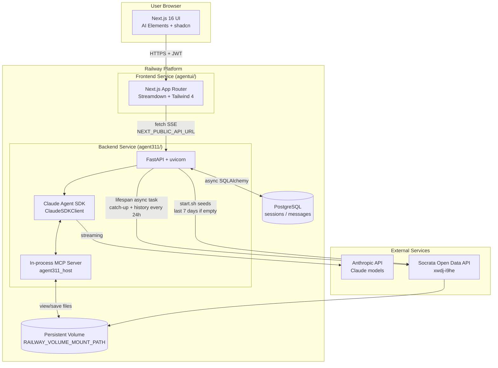

# Architecture Diagrams

Visual reference for how Agent Austin fits together. Diagrams use Mermaid and render natively in GitHub.

---

## System Overview

---

## Agent Skills

The Claude agent running inside the backend has access to **skills** — structured instructions that teach it how to perform specific tasks. Skills live in `agent311/.claude/skills/` and are automatically invoked when the user's message matches their trigger phrases.

### download-311-data

Downloads City of Austin 311 service request data from the Socrata Open Data API (`data.austintexas.gov`) into the local DuckDB. Supports full downloads and incremental delta merges — fetches only rows newer than `MAX(sr_created_date)` and deduplicates by `sr_number`. Handles pagination for datasets exceeding the 100k row API limit. The boot script seeds the last 7 days; the lifespan async task in `main.py` extends both directions every 24h.

**Triggers:** "download 311 data", "refresh 311 data", "update 311 data", "fetch Austin 311"

### analyze-311-data

Runs exploratory analysis on the local 311 DuckDB and presents findings with text summaries. Covers top request types, department breakdown, status distribution, reporting method, temporal patterns (day-of-week, hour-of-day), busiest/quietest days, top ZIP codes, council districts, resolution times by category, open request backlogs, and oldest still-open requests. Includes a 7-day ASCII bar chart.

**Triggers:** "analyze 311 data", "311 insights", "311 statistics", "311 trends", "what's interesting in 311"

### visualize

Fires **automatically** whenever the user asks a data question — no explicit request needed. If the answer involves 3+ data points, the agent generates an interactive Plotly chart (dark theme, saved via `save_chart`, previewed in the artifact panel). Supports bar, line, area, pie/donut, histogram, and multi-panel subplot dashboards. Falls back to ASCII text charts only when the user explicitly asks for terminal output.

**Triggers:** "how many", "top", "compare", "trend", "breakdown", "distribution", "by district", "by zip", or any question whose answer benefits from a chart

### create-report

Generates self-contained HTML reports combining Plotly charts, metric cards, data tables, and narrative takeaways — all styled in a dark theme. Also supports PNG chart exports (via kaleido) and CSV data dumps. Reports are saved via `save_report` to the persistent volume and appear in the sidebar file tree.

**Triggers:** "create a report", "generate a report", "311 report", "weekly report", "summary report"

### 311-resolution-rate

Looks up historical resolution rates for a specific type of 311 complaint. Maps the user's complaint to the closest category (Code Compliance, Graffiti, Streets, ARR, Parks, Animal Services, Austin Energy, Austin Water) and reports the percentage resolved, volume per year, common reasons complaints go unresolved, and tips to improve the odds of resolution.

**Triggers:** User asks about resolution rates or likelihood of a complaint being addressed

### estimate-complaint

Estimates how long a complaint or issue will take to resolve. Evaluates severity (critical → low), complexity (simple → very complex), dependencies (none → regulatory), and resources required (single dev → cross-team). Outputs a structured estimate with time breakdown, confidence level, assumptions, risk factors, and next steps.

**Triggers:** User asks how long a complaint will take to resolve
