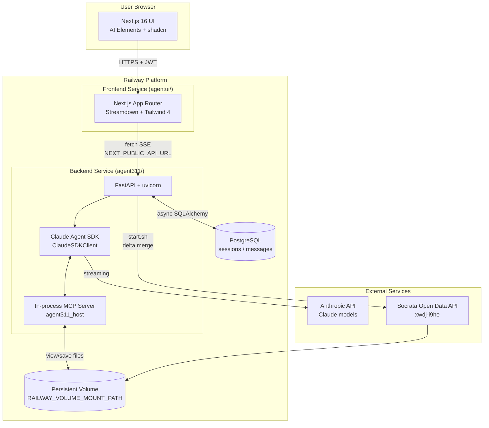
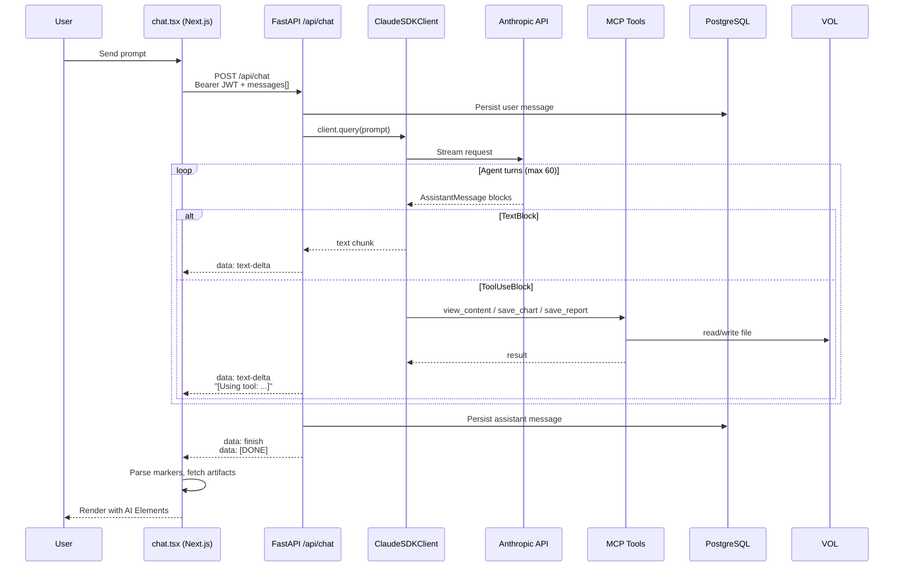
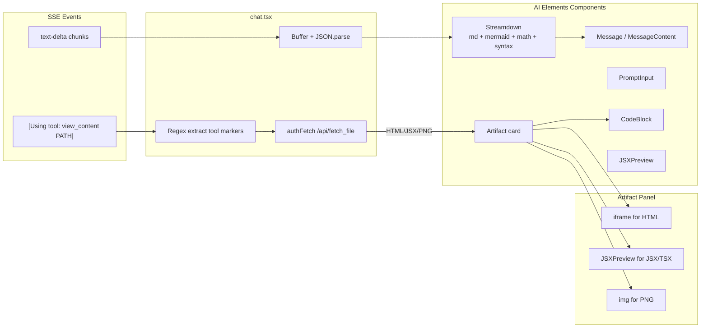
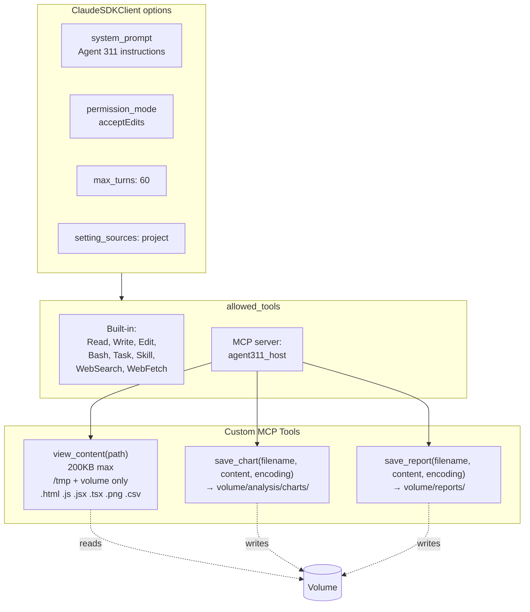
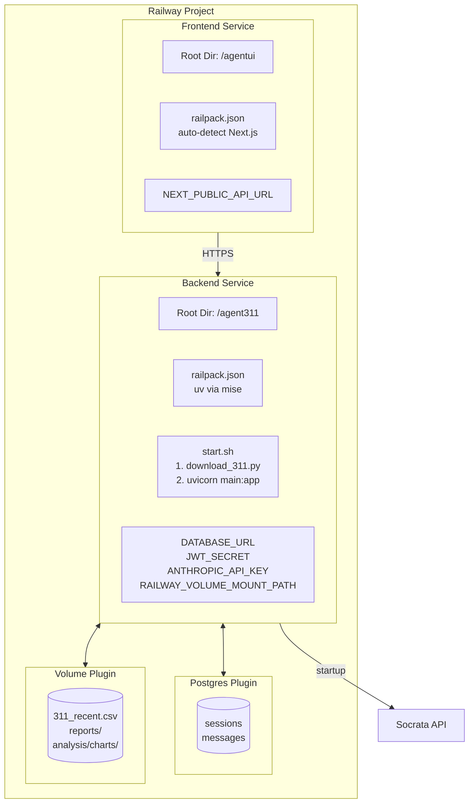
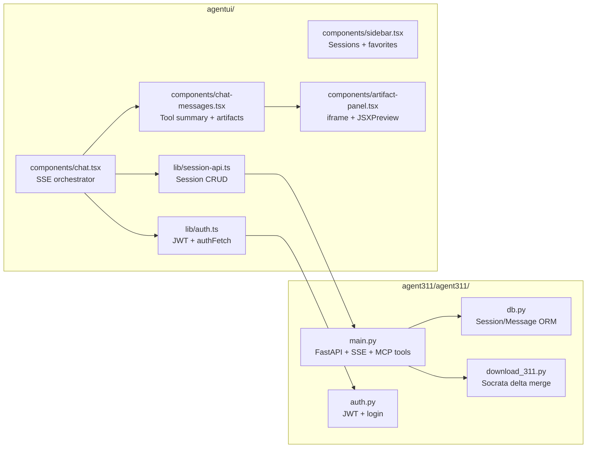
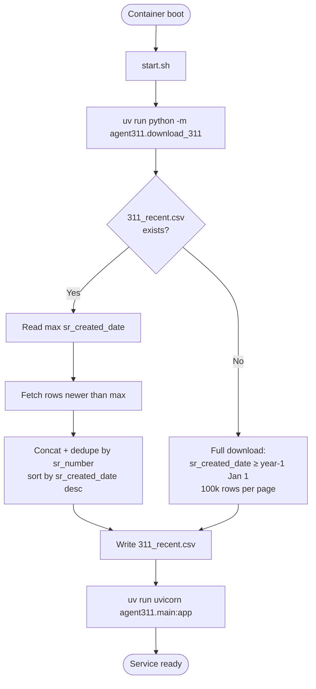
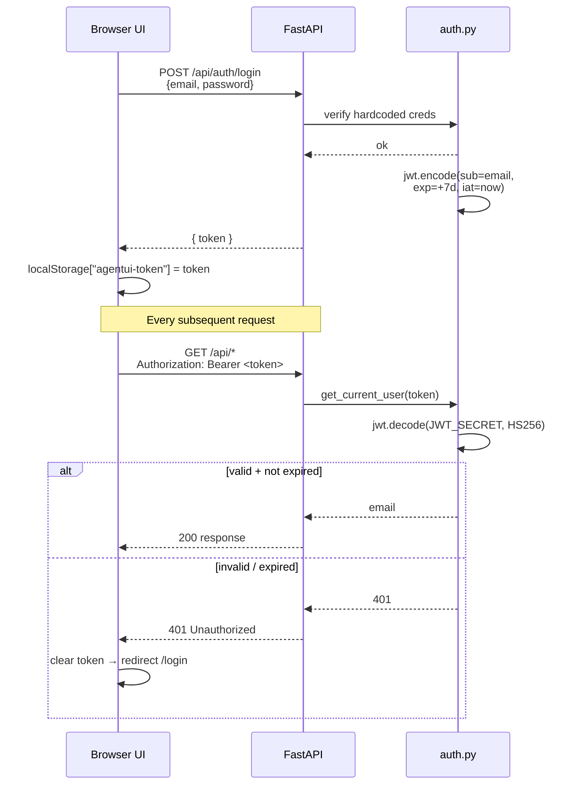

# Architecture Diagrams

Visual reference for how Agent Austin fits together. All diagrams use Mermaid and render natively in GitHub.

## Contents

| Diagram | What it shows |
|---|---|
| [High-Level System](#1-high-level-system) | Browser → Next.js → FastAPI → Claude / Postgres / Volume / Socrata |
| [Chat Streaming Flow](#2-chat-streaming-flow-sse) | End-to-end request lifecycle for a chat turn |
| [AI Elements Rendering](#3-ai-elements-rendering-pipeline) | How SSE events become rendered UI |
| [Claude Agent SDK Wiring](#4-claude-agent-sdk--tool--mcp-wiring) | Allowed tools, custom MCP server, permissions |
| [Railway Deployment](#5-railway-deployment-topology) | Two services, Postgres plugin, persistent volume |
| [Component → File Map](#6-component--file-map) | Which file owns which responsibility |
| [Data Pipeline](#7-data-pipeline--311-delta-merge) | How 311 data is kept fresh on startup |
| [Auth Flow](#8-auth-flow) | JWT issuance, storage, and validation |

---

## 1. High-Level System

---

## 2. Chat Streaming Flow (SSE)

---

## 3. AI Elements Rendering Pipeline

---

## 4. Claude Agent SDK — Tool & MCP Wiring

---

## 5. Railway Deployment Topology

---

## 6. Component → File Map

---

## 7. Data Pipeline — 311 Delta Merge

---

## 8. Auth Flow

